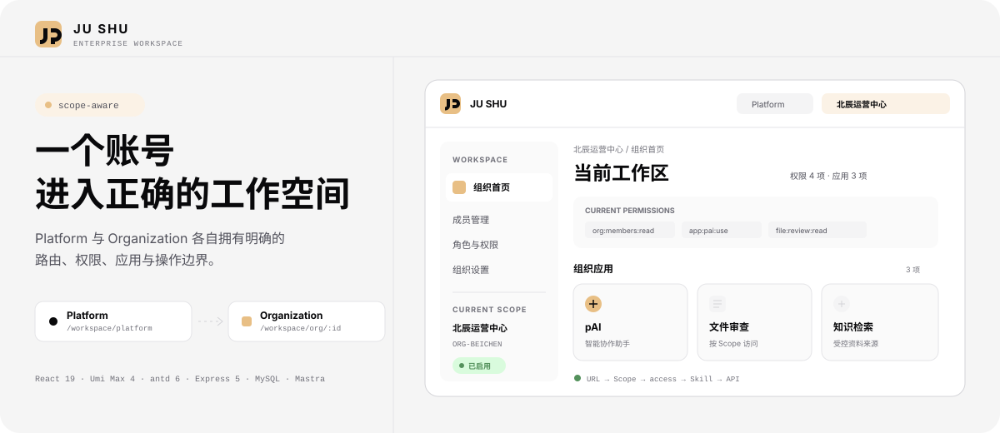

# JU SHU 企业工作台

一个账号进入 Platform 或指定 Organization；当前 URL、菜单、权限、应用与 API
上下文使用同一个 WorkspaceScope。仓库同时包含 React 前端、Express 服务端和 pAI
Agent 链路，可用于继续开发多组织企业工作台。

## 项目核心

| 能力 | 仓库中的实现 | 带来的边界 |
| --- | --- | --- |
| WorkspaceScope | Platform / Organization 路由、切换器、应用标签与访问守卫 | 不同组织不共享菜单、标签或应用上下文 |
| 认证与授权 | JWT Bearer、`POST /api/currentUser/get`、MySQL 用户/组织/成员/授权数据 | 用户身份与 Scope 均由服务端结果决定 |
| pAI | Ant Design X、Express、Mastra、DeepSeek、可选 Firecrawl、项目自有 SSE | Agent 不替代 HTTP 鉴权，也不能自行扩大租户范围 |

主要请求路径：

```text
URL /workspace/... → WorkspaceScope → route guard → authorized App
  → Bearer API → Express validation / permission → MySQL or pAI service
  → reasoning-delta / text-delta / sources / done → Ant Design X
```

## 当前可用范围

### Workspace 与管理

- Platform 与 Organization 两级入口、默认落点和整页 Scope 切换。
- 当前 Scope 内的应用标签、权限摘要与按当前应用授权模型过滤的应用启动卡。
- 注册、登录、退出、密码重置与登录态恢复。
- Super Admin 的组织查询/创建/编辑/受约束删除，以及全人员分页查询。

### pAI

- 普通对话与联网搜索共用一个 pAI Agent。
- 浏览器只提交当前问题和能力开关；服务端从 MySQL 读取可信会话历史。
- `webSearchEnabled` 按请求开放 Firecrawl Tool；本地知识可作为受控上下文注入。
- 服务端把模型事件转换为稳定的项目 SSE，前端不直接依赖模型原生协议。
- 会话、Run、消息和来源由后端持久化，并按 Platform/Organization Scope 隔离。

> [!IMPORTANT]
> RAG、文件上传、后台生成任务、线上 Trace 与成本审计尚未完成。

## 技术栈

| 层 | 主要技术 |
| --- | --- |
| Web | React 19 · Umi Max 4 · Ant Design 6 · ProComponents 3 · Ant Design X |
| API | Node.js 22+ · Express 5 · TypeScript · Zod |
| 数据与安全 | MySQL · Argon2id · JOSE / JWT |
| AI | Mastra · DeepSeek · Firecrawl |
| 工程 | Vitest · Biome · utoopack |

## 本地运行

准备 Node.js 22+、npm 和一个可连接的 MySQL 数据库。

### 1. 获取代码并安装依赖

```bash
git clone https://gitee.com/jushu2026/xone-fronted.git
cd xone-fronted
npm ci
npm --prefix server ci
```

### 2. 配置并启动 API

```bash
cp server/.env.example server/.env
npm --prefix server run migrate
npm --prefix server run dev
```

`server/.env` 至少需要 MySQL 连接信息和长度不少于 32 字节的 `JWT_SECRET`。
`DEEPSEEK_API_KEY` 与 `FIRECRAWL_API_KEY` 分别启用 pAI 模型和联网搜索；缺少
DeepSeek 配置时，认证服务仍可运行，但 pAI 接口返回 `503`。

API 默认监听 `http://localhost:3000`。

### 3. 启动 Web

另开终端，在仓库根目录运行：

```bash
npm run dev
```

Web 默认位于 `http://localhost:8000`，开发环境将 `/api` 转发到本地 API。

## 验证与开发

| 目标 | 命令 |
| --- | --- |
| 前端开发 | `npm run dev` |
| 前端类型与 Biome 检查 | `npm run lint` |
| Ant Design 专项检查 | `npx antd lint ./src` |
| 前端测试 / 构建 | `npm test` / `npm run build` |
| 后端测试 / 类型检查 | `npm --prefix server test` / `npm --prefix server run typecheck` |
| 后端构建 | `npm --prefix server run build` |

## 仓库地图

```text
config/       Umi 配置、路由与本地 API 代理
docs/         架构、路线图与 API 契约
openapi/      前端 API 机器契约
server/       Express、MySQL、Mastra、迁移与测试
src/          React 应用、Workspace、权限与 pAI 页面
```

继续阅读：

- [Ant Design Pro 开发速查](./docs/cheatsheet.zh-CN.md)
- [认证与权限 API 契约](./docs/backend-auth-api-bearer-only.md)

## 安全边界

- 不提交 `.env`、数据库凭据、JWT Secret 或模型 API Key。
- 用户与 Organization Scope 只接受服务端认证结果，不信任浏览器自报身份。
- pAI Tool 只调用受控 Service，不接受任意文件路径、SQL 或租户范围。
- 生产环境仍需完成 HTTPS、CORS、监控、审计和安全加固验收。

## 上游与许可证

前端基础来自 [Ant Design Pro](https://github.com/ant-design/ant-design-pro)。项目沿用
[MIT License](./LICENSE)。
